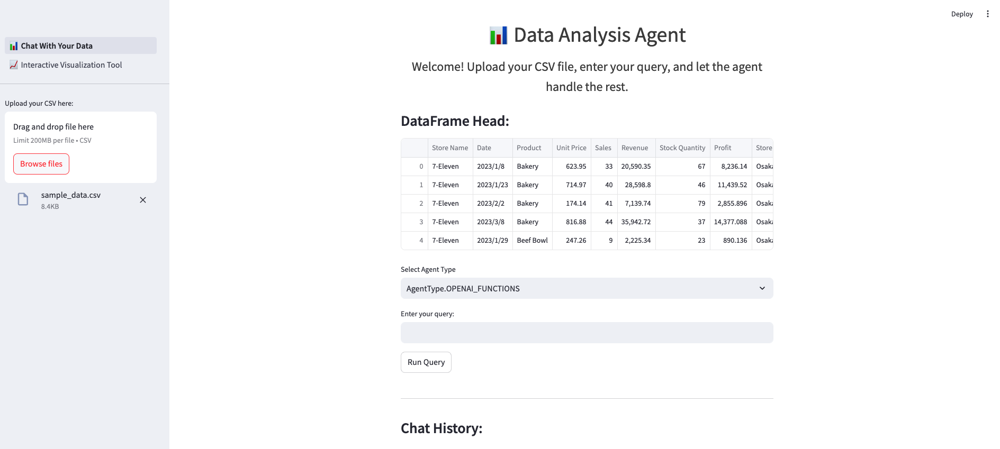
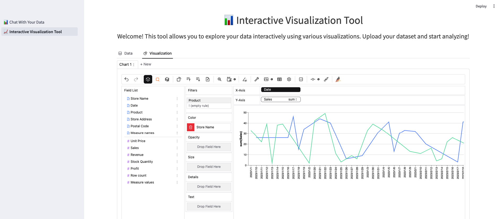

# Hướng Dẫn Xây Dựng Công Cụ Trợ Giúp Phân Tích Dữ Liệu (DAGPT)

## Giới Thiệu

Mình sẽ cùng với bạn xây dựng một công cụ phân tích dữ liệu hữu ích và tiện lợi tên là DAGPT (Data Analysis GPT). Công cụ này sử dụng các mô hình ngôn ngữ lớn (LLMs) để hỗ trợ việc thao tác và phân tích dữ liệu thông qua giao diện đàm thoại. Dự án này sử dụng Python, Langchain, Streamlit, PyGWalker, OpenAI API để tạo ra một ứng dụng web tương tác, cho phép người dùng tải lên dữ liệu, đặt câu hỏi, khám phá dữ liệu và nhận được các phân tích chi tiết.

## Nội Dung

### 1. Giới Thiệu về DAGPT

- **Tổng quan:** DAGPT là một công cụ phân tích dữ liệu sử dụng các mô hình ngôn ngữ lớn để hỗ trợ các tác vụ phân tích và thao tác dữ liệu qua giao diện đàm thoại.
- **Tính năng:**
  - **Tải lên tệp CSV:** Dễ dàng tải lên dữ liệu CSV qua thanh bên.
  - **Phân tích dữ liệu:** Nhập các truy vấn về dữ liệu và nhận phản hồi được hỗ trợ bởi LLMs.
  - **Trực quan hóa dữ liệu:** Tạo và hiển thị các biểu đồ dựa trên các truy vấn dữ liệu.
  - **Công cụ trực quan hóa tương tác:** Khám phá dữ liệu một cách tương tác bằng cách sử dụng các biểu đồ tùy chỉnh.

### 2. Công Cụ và Gói Cần Thiết

- **Python 3.9 hoặc cao hơn:** Ngôn ngữ lập trình chính để phát triển ứng dụng.
- **Langchain:** Khung phát triển ứng dụng sử dụng các mô hình ngôn ngữ lớn.
- **Streamlit:** Khung ứng dụng mã nguồn mở cho các dự án Machine Learning và Khoa học dữ liệu.
- **Pygwalker:** Công cụ tạo trực quan hóa tương tác.
- **OpenAI API (tùy chọn):** Sử dụng để truy cập các mô hình ngôn ngữ tiên tiến.

### 3. Hướng Dẫn Chi Tiết

#### Bước 1: Thiết Lập Cơ Bản

- Xây dựng cấu trúc dự án.
- Thiết lập môi trường ảo.
- Cài đặt các gói cần thiết.
- Thiết lập kho lưu trữ Git để lưu trữ mã nguồn dự án.

#### Bước 2: Xây Dựng Công Cụ "Chat Với Dữ Liệu"

- Sử dụng Streamlit để xây dựng giao diện người dùng.
- Sử dụng các bộ công cụ của Langchain để xây dựng công cụ phân tích dữ liệu.
- Sử dụng mô hình GPT của OpenAI.

#### Bước 3: Xây Dựng Công Cụ Trực Quan Hóa Tương Tác

- Nhúng Pygwalker vào giao diện Streamlit để xây dựng công cụ trực quan hóa tương tác.

### 4. Kết Luận

- Với khả năng của LLMs, việc viết một ứng dụng thực hiện các tác vụ phân tích dữ liệu phức tạp hàng ngày trở nên rất dễ dàng.
- Sử dụng Streamlit giúp dễ dàng xây dựng giao diện đàm thoại và các khả năng trực quan hóa mạnh mẽ, làm cho việc phân tích dữ liệu trở nên dễ tiếp cận hơn với mọi người.
- Pygwalker là một công cụ miễn phí và hữu ích thay thế cho Tableau và có thể được nhúng vào ứng dụng của chúng ta.
- Bằng cách làm theo hướng dẫn này, mọi người có thể tự xây dựng công cụ phân tích dữ liệu của riêng mình, tận dụng sức mạnh của LLMs và Streamlit.

## Liên Hệ

Nếu bạn có bất kỳ câu hỏi hoặc góp ý nào, hãy để lại bình luận dưới hoặc liên hệ với mình qua email: [phanminhhuept@gmail.com].

## Liên Kết Hữu Ích

- [Streamlit Documentation](https://docs.streamlit.io/)
- [Pandas Documentation](https://pandas.pydata.org/docs/)
- [Langchain Documentation](https://langchain.com/docs/)
- [Pygwalker Documentation](https://pygwalker.github.io/)
- [OpenAI API](https://www.openai.com/)

## Tác Giả

[phanminhhuept@gmail) - Người bạn đồng hành cùng mọi người trên con đường chinh phục lĩnh vực Khoa Học Dữ Liệu và AI

---

Cảm ơn bạn đã theo dõi! 

## Phụ Lục: Cách Thiết Lập Khóa API của OpenAI

1. **Đăng Ký / Đăng Nhập vào OpenAI:**

   - Truy cập trang web OpenAI và tạo tài khoản hoặc đăng nhập nếu bạn đã có tài khoản.

2. **Đi tới API Keys:**

   - Sau khi đăng nhập, vào phần API trong bảng điều khiển tài khoản của bạn. Thường phần này nằm dưới tab "API Keys".

3. **Tạo Khóa API Mới:**

   - Nhấn vào nút "Create new secret key". Hệ thống sẽ tạo một khóa API mới cho bạn.

4. **Sao Chép Khóa API:**
   - Sau khi khóa được tạo, hãy sao chép nó và thay thế khóa API trong tệp `.env` của dự án.

Truy cập [OpenAI](https://www.openai.com/) để biết thêm chi tiết.


# DAGPT: Data Analysis GPT

DAGPT is a data analysis tool that uses LLMs (Large Language models) to assist with data manipulation and analysis tasks via a conversational interface. This project leverages Streamlit to provide an interactive web application where users can upload their data, ask questions, explore your data interactively and receive insights.

## Features

- **CSV File Upload**: Easily upload your CSV data through the sidebar.
- **Data Analysis**: Enter queries about your data and get responses powered by LLMs.
- **Data Visualization**: Generate and display plots based on your data queries.
- **Interactive Visualization Tool**: Explore your data interactively using various visualizations. Upload your dataset and start analyzing with drag-and-drop functionality to create customized charts.

## Application Interface

### Chat With Your Data


Welcome! Upload your CSV file, enter your query, and let the agent handle the rest.

### Interactive Visualization Tool


Welcome! This tool allows you to explore your data interactively using various visualizations. Upload your dataset and start analyzing!

### Demo Video


## Getting Started

### Prerequisites

- Python 3.9 or higher
- pip (Python package installer)

### Installation

1. Clone the repository:

   ```bash
   git clone https://github.com/pmhue/Data_Analysys_AI_GPT.git
   cd Data_Analysys_AI_GPT
   ```

2. Create a virtual enviroment:

    ```
    python -m venv .venv
    source .venv/bin/activate   # On Windows use `.venv\Scripts\activate`
    ```

3. Install the required dependencies:

   ```bash
   pip install -r requirements.txt
   ```

4. Set up environment variables:
    Create a `.env` file in the root directory of the project and add your environment variables. Example is provided in `.env.sample`:

    ```
    # API keys
    OPENAI_API_KEY=your_openai_api_key
    GOOGLE_API_KEY=your_google_api_key

    # Python path
    PYTHONPATH=/path/to/dagpt/folder
    ```

### Running the Application

To start the Streamlit app, run the following command in your terminal:

```bash
streamlit run 1_📊_Chat With Your Data.py
```

This will launch the web application in your default web browser.

### Usage

1. Upload a CSV file containing your data.
2. Use the text input to ask questions about the data.
3. Use the interactive visualization tool to explore your data and create visualizations.

## Project Structure

```
├── README.md
├── 1_📊_Chat With Your Data.py
├── dagpt
│   ├── agents
│   │   ├── base.py
│   │   └── pandas_agent.py
│   ├── models
│   │   └── llms.py
│   ├── prompts
│   │   └── prompts.py
│   ├── tools
│   │   ├── tools.py
│   │   └── tools_ori.py
│   └── utils
│       └── utils.py
├── data
│   └── sample_data.csv
├── notebooks
├── pages
│   └── 2_📈_Interactive Visualization Tool.py
├── requirements.txt
│── images
│   └── chat_with_data.png
│   └── interactive_visualization_tool.png
└── videos
    └── demo_video_01.mp4
    └── demo_video.gif
```

### Project Components

- `1_📊_Chat With Your Data.py`: Script for the "Chat With Your Data" feature.
- `dagpt/agents`: Contains the agent classes responsible for handling user queries.
  - `base.py`: Base class for agents.
  - `pandas_agent.py`: Agent specifically designed for handling pandas DataFrames.
- `dagpt/models`: Contains the language model classes.
  - `llms.py`: Class for interacting with GPT models.
- `dagpt/prompts`: Contains prompt templates for the agents.
  - `prompts.py`: Prompt templates for different scenarios.
- `dagpt/tools`: Contains utility tools for data manipulation and model interactions.
  - `tools.py`: Customized tools module.
  - `tools_ori.py`: Original tools module.
- `dagpt/utils`: General utility functions.
  - `utils.py`: Utility functions used throughout the project.
- `data`: Directory for storing sample data files.
  - `sample_data.csv`: A sample CSV file for testing.
- `notebooks`: Directory for Jupyter notebooks (for experiments and testing).
- `pages`: Directory for additional Streamlit pages.
  - `2_📈_Interactive Visualization Tool.py`: Script for the interactive visualization tool.
- `requirements.txt`: List of required Python packages.
- `images`: Directory for storing demo images.
  - `chat_with_data.png`: Image showing the "Chat With Your Data" interface.
  - `interactive_visualization_tool.png`: Image showing the "Interactive Visualization Tool" interface.
- `videos`: Directory for storing demo videos.

## Contributing

Contributions are welcome! Please open an issue or submit a pull request on GitHub.

## Acknowledgements

- [LangChain](https://github.com/langchain-ai/langchain)
- [Streamlit](https://www.streamlit.io/)
- [Pygwalker](https://github.com/Kanaries/pygwalker)

## License

This project is licensed under the MIT License - see the LICENSE file for details.